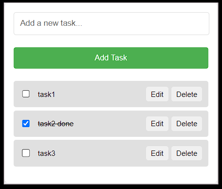

# TODO app -Extension
A simple todo app extension for chrome using html, css and javascript usable while browsing without having to move away from the page.
Enables CRUD functionality: Users can add, read, edit, delete and mark as done the to-dos anytime.

 # Screenshot
Here we have project screenshot :

